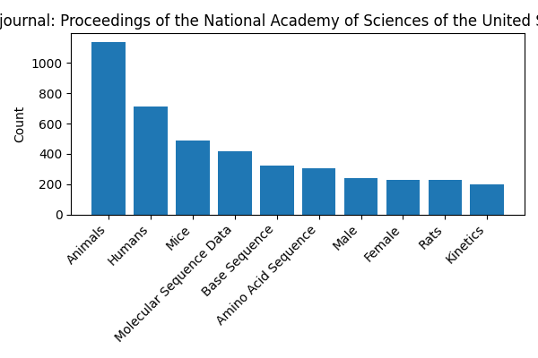
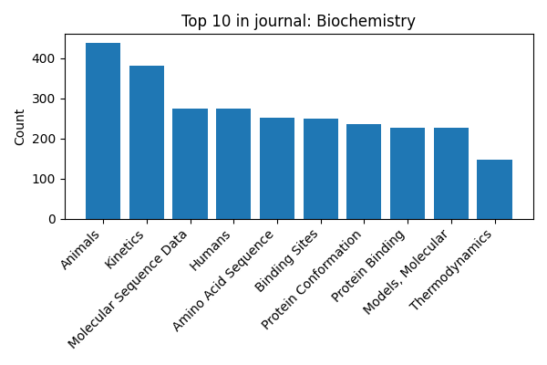

# NLP-PubMed

Automate the process of assigning MeSH terms to articles from PubMed using a Biomed-BERT multi-label classifier.

## Project Overview

This repository implements a pipeline to:

1. Load PubMed articles from JSON datasets.
2. Train a multi-label classification model (PubMedBERT) to predict MeSH major terms.
3. Evaluate performance on a held-out test set (20,000 articles).
4. Predict MeSH labels for an unannotated judge set (10,000 articles) and save results.

## Data

Datasets are publicly available at: [https://drive.google.com/drive/folders/1MlIDbsrJS5Sf0B48MTfvDOurMjhrQU-\_?usp=share\_link](datasets)
Please download the following files from that link into the `dataset/` folder:

- `training-set-100000.json`
- `test-set-20000-rev2.json`
- `judge-set-10000-unannotated.json`

## Set-up

Follow these steps in your terminal to get started:

1. **Clone the repository**

   ```bash
   git clone git@github.com:ramosv/NLP-PubMed.git
   ```
2. **Navigate into the project directory**

   ```bash
   cd NLP-PubMed
   ```
3. **Create a virtual environment**

   ```bash
   python -m venv .venv
   ```
4. **Activate the virtual environment**

   ```bash
   source .venv/bin/activate
   ```
5. **Install dependencies**

   ```bash
   pip install -r requirements.txt
   ```

   Some requirements may need manual installation; see comments in `requirements.txt`.
6. **Test the pipeline**

   ```bash
   python MeSH/model.py
   ```

## Data Analysis

In other words, for every document–MeSH term pair we have a binary classification problem:

- A MeSH term receives a positive label (`1`) if that term is present in the combined Title + Abstract text.
- If the MeSH term is not present, it receives a negative label (`0`).

I did some exploration on the dataset to see what we were working with:

```bash
(22373, 4)
word	count	journal	in_that_journal
0	Humans	61956	The Journal of Biological Chemistry	1341
1	Male	37543	The American Journal of Physiology	447
2	Female	37301	Cancer	417
3	Animals	33144	The Journal of Biological Chemistry	1812
4	Adult	22688	Cancer	292
5	Middle Aged	20922	Cancer	345
6	Aged	14980	Cancer	279
7	Mice	10940	The Journal of Biological Chemistry	671
8	Rats	8500	The Journal of Biological Chemistry	518
9	Adolescent	8491	The Journal of Clinical Endocrinology and Metabolism	99
```

The training set has 100,000 documents (PMIDs) and over 22k unique MeSH terms.

Journal statistics appeared more stable, so I plotted the top terms in several high-volume journals to see if this information could aid training.

|       Journal 1       |       Journal 2       |
| :-------------------: | :-------------------: |
|  |  |

|       Journal 3       |       Journal 4       |
| :-------------------: | :-------------------: |
|  |  |

|       Journal 5       |       Journal 6       |
| :-------------------: | :-------------------: |
|  |  |

There was a clear pattern: the same MeSH terms repeatedly appear in the journals with the most publications.

When exploring all unique journals in the training dataset, we found 1,529 distinct journals. I collected statistics on each journal's MeSH-term counts (lower quartile, median, upper quartile) and the total number of articles per journal:

```bash
journal	lower_quartile	median	upper_quartile	count
0	20 Century British History	10	10	10	1
1	AANA Journal	8	9	13	19
2	AAOHN Journal	7	11	13	22
3	AIDS Alert	7	8	9	14
4	AIDS Clinical Care	6	7	14	3
... 	... 	...	...	...
1524	Zhongguo Xue Xi Chong Bing Fang Zhi Za Zhi	7	9	11	14
1525	Zhongguo Yi Miao He Mian Yi	9	9	10	4
1526	Zhongguo Zhen Jiu = Chinese Acupuncture & Moxibustion	9	10	11	44
1527	Zhurnal Mikrobiologii, Epidemiologii, i Immunobiologii	8	11	14	155
1528	Hokkaido Igaku Zasshi = The Hokkaido Journal of Medical Science	10	11	14	40
```

Perfect. Now that we have a solid understanding of the data, I will use Bidirectional Encoder Representations from Transformers (BERT), first introduced in [“BERT: Pre-training of Deep Bidirectional Transformers for Language Understanding”](https://arxiv.org/abs/1810.04805). The pretrained model is loaded from `https://huggingface.co/google-bert/bert-base-uncased`.

In my code, `model.py` will perform these steps:

- Load the training and test sets
- Train a multi‑label classification model (`bert-base-uncased`) to predict MeSH major terms
- Compute accuracy, micro-precision, micro-recall, and micro-F1 on the test set
- Print evaluation metrics and save the best checkpoint in `results/`

### Judge-Set Predictions

After training, the script automatically runs inference on the judge set and saves a JSON file. Labels are thresholded at sigmoid ≥ 0.5 and converted using `MultiLabelBinarizer`.

## Results

Evaluation on the 20,000-article test set (3 epochs):

**First run:**

```bash
{'eval_loss': 1.4463,
 'eval_accuracy': 0.0,
 'eval_micro_precision': 0.0008774,
 'eval_micro_recall': 0.5963522,
 'eval_micro_f1': 0.00175225
}
```

- Initially, every prediction was “Humans.” The mistake was not applying the sigmoid to the logits.

**Second run:**

```bash
{
  "eval_loss": 0.6812,
  "eval_precision": 0.0003481,
  "eval_recall": 0.3348,
  "eval_f1": 0.0006359,
  "eval_exact_match_accuracy": 0.0,
  "eval_sample_accuracy": 0.5966
}
```

- Fixed the evaluation logic to apply `sigmoid(logits)` before thresholding (no longer predicted only “Humans”).
- Tuned a separate cutoff for each MeSH term on the dev split instead of a global 0.5.
- Added two new metrics: **exact-match** (all labels correct) and **sample-level** (percent of correct labels per article).
- Precision remained extremely low despite improved recall.

**Third run:**

```bash
{
  "train_loss": 1.1198,
  "eval_loss": 1.1272,
  "eval_precision": 0.0013367,
  "eval_recall": 0.6002467,
  "eval_f1": 0.0024908,
  "eval_exact_match_accuracy": 0.0,
  "eval_sample_accuracy": 0.8630781
}
```

In this third run:

- I introduced class-weighted loss to give infrequent MeSH terms a greater chance of selection.
- The model's sample-level accuracy jumped to 86%, meaning we match about 86% of MeSH terms on average when comparing ground truth to predictions.

Unfortunately, exact-match accuracy remains 0%. To address this, I plan to incorporate additional information from the training set, specifically, journal statistics, to narrow the average number of MeSH terms per journal. A journal-based hierarchy should help the transformer focus on the most likely terms and improve exact-match performance.

## Post-processing

Following training and initial inference, we applied a pruning step that uses our term–journal co‑occurrence map and per‑journal MeSH‑term medians to truncate each document's predicted labels to its journal's median count. This journal-aware pruning builds on our data statistics to keep only the most characteristic terms and boost precision.

These post-processing output and other experimentations not mentioned here can be seen in the `.json` files at the root of the repo.